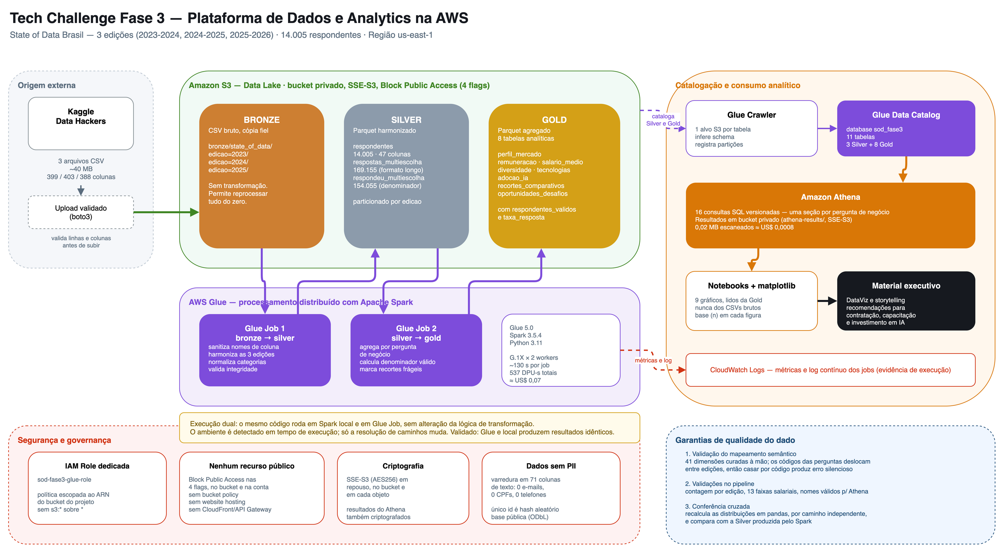
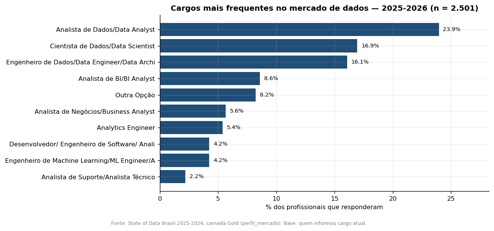
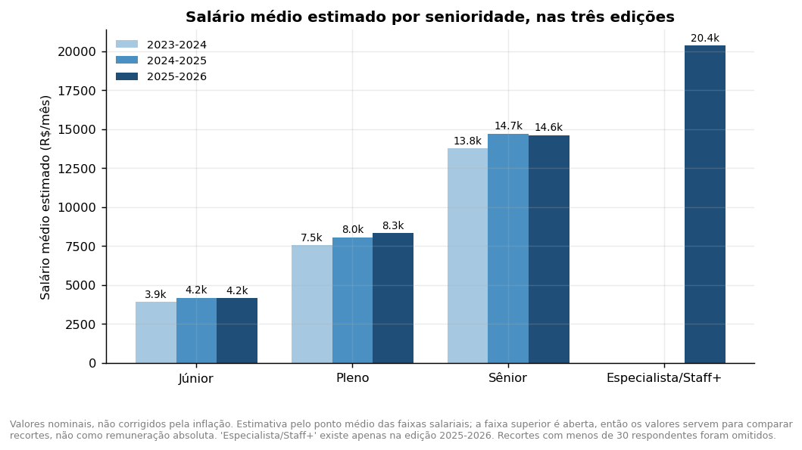
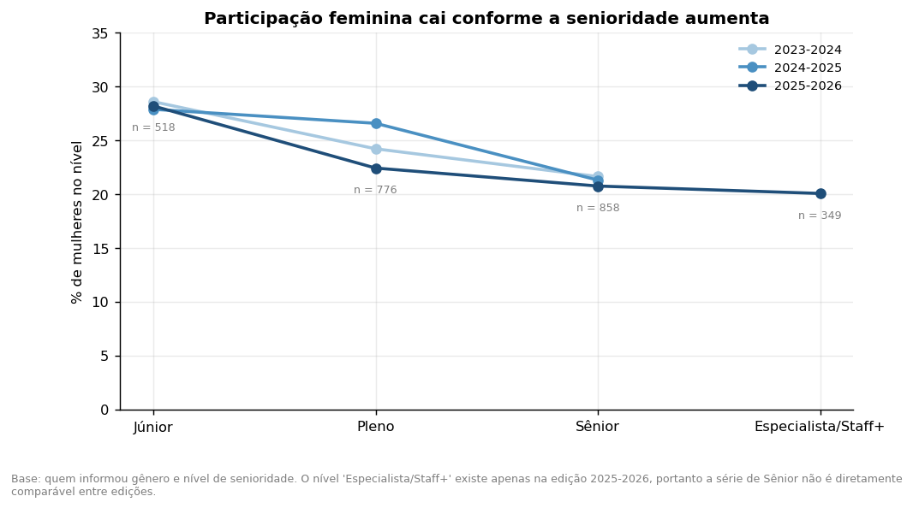
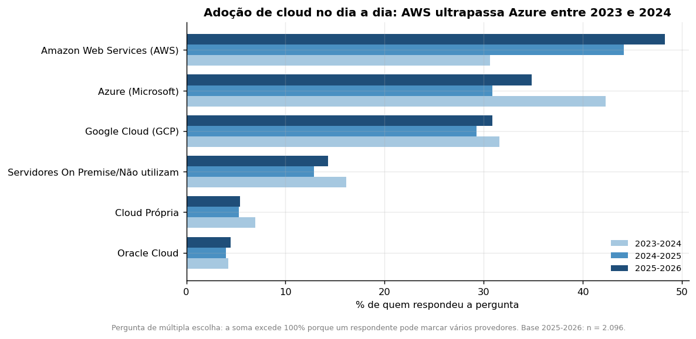
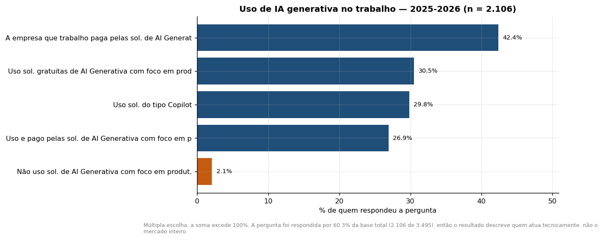

# Tech Challenge — Fase 3

**Plataforma Analítica State of Data Brasil**  
Relatório técnico de Engenharia de Dados e Analytics em AWS  
POSTECH DTAT — Setembro de 2026

## Resumo executivo

Este relatório documenta a construção e a validação de uma plataforma analítica em AWS para as três edições mais recentes da pesquisa State of Data Brasil. A solução integra 14.005 respostas, harmoniza questionários estruturalmente diferentes e produz indicadores sobre mercado, remuneração, diversidade, tecnologias, inteligência artificial, modelos de trabalho e desafios de liderança.

O principal risco técnico não era o volume, mas a compatibilidade semântica: códigos iguais representam perguntas diferentes entre edições. Para impedir resultados silenciosamente incorretos, o pipeline usa um mapeamento curado de 41 dimensões, validações de integridade e uma conferência independente em pandas.

| Indicador | Resultado |
|---|---|
| Edições analisadas | 2023-2024, 2024-2025 e 2025-2026 |
| Respondentes | 14.005 |
| Dimensões harmonizadas | 41 |
| Tabelas catalogadas | 11: 3 Silver e 8 Gold |
| Consultas Athena | 16 concluídas, sem falhas |
| AWS Glue Jobs | 2 concluídos com sucesso |
| Custo medido | US$ 0,07 |

## 1. Objetivo e contexto

O desafio simula uma instituição financeira que precisa decidir como contratar, capacitar e reter profissionais de Dados e IA. O projeto transforma dados públicos de pesquisa em evidências para decisões sobre perfis profissionais, remuneração, diversidade, tecnologias, IA generativa, trabalho remoto e prioridades de gestão.

### 1.1 Perguntas de negócio

- Quais cargos e perfis concentram o mercado e quais são mais valorizados?
- Como remuneração e diversidade variam por senioridade, gênero e região?
- Quais tecnologias, bancos de dados e provedores de nuvem predominam?
- Como evoluíram a adoção de IA generativa e as prioridades das empresas?
- Quais modelos de trabalho, critérios de escolha e desafios de liderança orientam a estratégia de pessoas?

## 2. Dados e escopo

| Edição | Respondentes | Colunas | Fonte |
|---|---:|---:|---|
| 2023-2024 | 5.293 | 399 | Data Hackers / Kaggle |
| 2024-2025 | 5.217 | 403 | Data Hackers / Kaggle |
| 2025-2026 | 3.495 | 388 | Data Hackers / Kaggle |
| Total | 14.005 | — | Três edições |

Os arquivos originais são preservados na camada Bronze. Os dados brutos não são versionados no repositório, tanto pelo tamanho quanto pela licença de distribuição; o README documenta os três datasets e os nomes esperados para reprodução. A inspeção de 71 colunas textuais não encontrou e-mails, CPFs ou telefones; o único identificador presente é um hash aleatório fornecido pela própria pesquisa.

## 3. Arquitetura da solução

A arquitetura segue o padrão Medallion. A camada Bronze mantém cópias fiéis dos CSVs; a Silver sanitiza nomes, normaliza categorias e harmoniza as edições em Parquet particionado; a Gold contém agregações orientadas às perguntas de negócio. O AWS Glue Data Catalog registra as tabelas e o Amazon Athena fornece acesso SQL. Gráficos e material executivo consomem somente a Gold.

| Camada | Papel | Formato e organização |
|---|---|---|
| Bronze | Preservação dos dados de origem | CSV, particionado por edição |
| Silver | Limpeza, tipagem e harmonização | Parquet Snappy, particionado por edição |
| Gold | Indicadores e recortes de negócio | Parquet agregado por domínio |
| Catálogo e consulta | Descoberta e SQL | Glue Data Catalog e Athena |

### 3.1 Componentes e execução

- Amazon S3 privado para as camadas Bronze, Silver, Gold e resultados do Athena.
- AWS Glue 5.0 com Apache Spark 3.5.4 em dois jobs PySpark.
- AWS Glue Data Catalog com 11 tabelas: três Silver e oito Gold.
- Amazon Athena para as 16 consultas analíticas versionadas.
- Python, pandas, matplotlib e python-pptx para validação e produtos de consumo.

## 4. Pipeline de dados

### 4.1 Bronze: ingestão e preservação

A ingestão valida a presença dos três arquivos e suas contagens esperadas antes do envio ao S3. Os objetos são organizados por edição e mantidos sem transformação para permitir rastreabilidade até a fonte. A execução registrada contém três objetos e 39,93 MB na Bronze.

### 4.2 Silver: limpeza e harmonização

A Silver é o núcleo do projeto. Todas as 388 colunas da edição 2025-2026 exigiam sanitização para compatibilidade com Athena. O pipeline também trata strings sentinela como `NA`, `NULL` e `N/A`; corrige dois erros de digitação nas faixas salariais; preserva nulos estruturais; deriva regiões e estimativas salariais; e transforma perguntas de múltipla escolha pelas colunas booleanas originais.

A união das edições é semântica, não baseada apenas no código da pergunta. O mapeamento manual contém 41 dimensões canônicas e registra os deslocamentos identificados. Perguntas cuja natureza mudou, como linguagem preferida em 2025-2026, não são apresentadas como séries diretamente comparáveis.

### 4.3 Gold: indicadores de negócio

A Gold materializa oito tabelas analíticas: perfil de mercado, salário médio, diversidade, tecnologias, adoção de IA, recortes comparativos, oportunidades e desafios, além de uma tabela auxiliar de faixas salariais. Cada agregação registra quantidade, percentual, respondentes válidos e taxa de resposta quando aplicável. Recortes com menos de 30 observações recebem a marcação `fragil`.

## 5. Qualidade, validação e rastreabilidade

- Gate de mapeamento: confirma a resolução das 41 dimensões e exibe os rótulos das três edições lado a lado.
- Integridade: valida 5.293, 5.217 e 3.495 linhas antes e depois das transformações.
- Contrato de esquema: exige nomes compatíveis com Athena e 13 faixas salariais canônicas.
- Conferência cruzada: recalcula 12 dimensões diretamente dos CSVs com pandas e compara com a Silver Spark.
- Catálogo: valida a leitura das 11 tabelas no Athena.
- Consultas: registra estado, tempo, bytes escaneados, colunas e amostras de resultado das 16 consultas.

Essas verificações cobrem tanto integridade quanto correção semântica. A conferência independente é essencial porque um pipeline pode preservar contagens e tipos e, ainda assim, associar respostas à pergunta errada. O princípio adotado é falhar explicitamente em vez de degradar silenciosamente.

## 6. Resultados analíticos

### 6.1 Perfil e remuneração

Em 2025-2026, Analista de Dados representa 23,95% dos 2.501 respondentes válidos, seguido por Cientista de Dados, com 16,95%, e Engenheiro de Dados, com 16,07%. Finanças e Bancos é o maior setor empregador, com 18,53%, o que reforça a aderência do estudo ao cliente fictício.

A remuneração média estimada em 2025-2026 é de R$ 4.153 para Júnior, R$ 8.314 para Pleno, R$ 14.622 para Sênior e R$ 20.373 para Especialista/Staff+. Engenheiro de Machine Learning aparece entre os cargos mais bem remunerados, com média estimada de R$ 19.600.

**Ressalva indispensável:** os salários são valores nominais e não foram corrigidos pela inflação. Entre 2023-2024 e 2025-2026, as variações nominais estimadas foram de aproximadamente 6,2% para Júnior, 10,2% para Pleno e 6,3% para Sênior. Esses percentuais não devem ser interpretados como ganho real de poder de compra sem a aplicação de um índice de preços e de períodos de referência compatíveis.

### 6.2 Diversidade

A participação feminina cai de 24,43% para 21,97% nas três edições. Na edição mais recente, o recorte por senioridade mostra 28,19% no nível Júnior e 20,06% em Especialista/Staff+. A diferença salarial observada é de 20,2%, com médias estimadas de R$ 11.198 para mulheres e R$ 14.036 para homens.

O gap é descritivo e não controla cargo, senioridade, experiência, região ou setor. Portanto, ele não mede discriminação entre pessoas em posições equivalentes; indica uma desigualdade agregada que merece investigação multivariada.

### 6.3 Tecnologias e inteligência artificial

A adoção declarada de AWS cresce de 30,61% para 48,28% nas três edições e ultrapassa Azure em 2024-2025. Em 2025-2026, PostgreSQL, com 36,78%, SQL Server, com 33,49%, Databricks, com 32,87%, e Amazon S3, com 28,82%, se destacam entre bancos e plataformas. Como são perguntas de múltipla escolha, as proporções não devem somar 100%.

Entre 2.106 respondentes válidos para uso de IA generativa em 2025-2026, 42,36% utilizam ferramentas pagas pela empresa, 30,53% usam opções gratuitas e 29,82% usam Copilot. Apenas 2,09% declaram não usar IA generativa, contra 19,72% em 2023-2024. A pergunta sobre prioridade de IA foi respondida por 652 gestores, equivalentes a 18,66% da amostra da edição; esse denominador limita a generalização.

### 6.4 Trabalho, região e oportunidades

Na edição 2025-2026, 20,76% trabalham presencialmente, mas apenas 1,86% desejam esse modelo. O híbrido flexível é a preferência de 42,97%. Remuneração, com 83,21%, flexibilidade remota, com 56,60%, e plano de carreira, com 32,34%, são os principais critérios de escolha profissional.

O Nordeste apresenta remuneração média estimada 23,8% inferior à do Sudeste: R$ 10.437 contra R$ 13.696. O Norte possui amostra muito pequena, com 48 respondentes na edição e 36 no corte salarial; seus resultados devem ser tratados como indicativos.

## 7. Premissas metodológicas

- As edições 2023-2024, 2024-2025 e 2025-2026 foram tratadas como as três mais recentes disponíveis.
- A Silver seleciona 41 dimensões curadas relevantes ao problema, e não todas as aproximadamente 400 colunas.
- O denominador de cada métrica é o número de pessoas que respondeu à pergunta, nunca a base total por padrão.
- Salário é estimado pelo ponto médio da faixa declarada; a faixa aberta acima de R$ 40.001 usa R$ 50.000.
- Especialista/Staff+ é preservado como categoria exclusiva de 2025-2026, sem reclassificação retroativa.
- Recortes com menos de 30 observações são marcados como frágeis e omitidos dos gráficos quando necessário.
- Glue 5.0 com dois workers G.1X foi escolhido por ser suficiente para o pequeno volume e minimizar custo.
- Perguntas de múltipla escolha usam as colunas booleanas explodidas da origem, sem separar texto por vírgula.

## 8. Vieses e limitações

- **Autosseleção:** a pesquisa é voluntária e não constitui amostra probabilística do mercado brasileiro.
- **Composição variável:** a última edição possui 34% menos respondentes que 2023-2024; mudanças podem refletir a amostra.
- **Concentração geográfica:** 62% da amostra mais recente está no Sudeste.
- **Salários nominais:** não foi aplicada correção inflacionária, logo a série não mede variação real de poder de compra.
- **Estimativa por faixa:** pontos médios reduzem a precisão individual e a faixa salarial superior exige arbitragem.
- **Gap de gênero não ajustado:** a diferença observada não controla cargo, senioridade, experiência, setor ou região.
- **Questionário condicional:** algumas métricas possuem baixa taxa de resposta, especialmente a seção de gestores.
- **Amostras pequenas:** recortes como Norte podem produzir estimativas instáveis.
- **Múltipla escolha:** percentuais de tecnologias e IA podem somar mais de 100%.
- **Mudanças no questionário:** determinadas dimensões não são comparáveis ou possuem quebra de série.

## 9. Segurança, privacidade e custo

O bucket S3 usa as quatro configurações de bloqueio de acesso público e criptografia SSE-S3. A função IAM dos jobs é limitada ao bucket do projeto. Nenhum endpoint público é criado. O identificador da conta é resolvido em tempo de execução e aparece mascarado nas evidências versionadas.

| Evidência | Resultado medido |
|---|---|
| Glue Job Bronze → Silver | SUCCEEDED, 130 segundos |
| Glue Job Silver → Gold | SUCCEEDED, 138 segundos |
| Consumo Glue | 537 DPU-segundos |
| Camadas | 113 objetos, 48,66 MB |
| Athena | 16 consultas, 0,02 MB escaneados |
| Custo total medido | US$ 0,07 |

## 10. Evidências da execução AWS

A execução real está documentada em `output/evidencias/execucao_glue.json` e `output/evidencias/consultas_athena.json`. Os arquivos registram status, duração, consumo, inventário das camadas e amostras dos resultados SQL sem expor o identificador da conta.

{{PRINTS_AWS}}

## 11. Reprodutibilidade

O repositório contém scripts modulares, notebook executado, SQL versionado, diagrama editável, dependências fixadas e instruções de ambiente. O pipeline local espelha o AWS Glue 5.0 com PySpark 3.5.4, Python 3.10 ou 3.11 e Java 17. Os dados públicos devem ser baixados do Kaggle conforme o README.

- Executar `src.validar_mapeamento` antes das transformações.
- Executar Bronze → Silver e a conferência cruzada independente.
- Executar Silver → Gold, gráficos, apresentação e este relatório.
- Na AWS, provisionar recursos privados, ingerir Bronze, executar jobs, catalogar e consultar no Athena.
- Conferir os artefatos finais e garantir ausência de dados brutos, credenciais e identificadores internos.

## 12. Conclusões e recomendações

A solução demonstra uma cadeia completa de Engenharia de Dados: ingestão, armazenamento em camadas, processamento distribuído, qualidade, catálogo, SQL analítico e comunicação executiva. O valor central está na harmonização segura de questionários incompatíveis e na explicitação dos denominadores e das limitações de cada métrica.

- Priorizar a formação interna de profissionais Júnior e Pleno, reduzindo dependência de contratações seniores disputadas.
- Manter flexibilidade remota ou híbrida e trilhas claras de carreira para atração e retenção.
- Tratar diversidade como indicador de gestão e aprofundar análises controladas por cargo e senioridade.
- Investir em governança para IA generativa, pois a adoção já é ampla mesmo fora de contratos corporativos.
- Atualizar o pipeline a cada nova edição, revisando semanticamente o questionário antes de qualquer união.
- Aplicar um deflator oficial em análises futuras para separar crescimento salarial nominal e real.

## Referências

- Data Hackers e Bain & Company. *State of Data Brasil*, edições 2023-2024, 2024-2025 e 2025-2026. Kaggle.
- Amazon Web Services. Documentação do Amazon S3, AWS Glue Data Catalog, AWS Glue ETL e Amazon Athena.
- Repositório do projeto: README, notebook executado, consultas SQL, código-fonte e evidências estruturadas.
