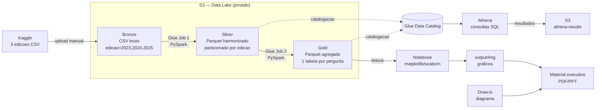

# Documento de Design

## Visão Geral

A solução implementa um Data Lake em três camadas (Bronze, Silver, Gold) sobre o S3, com transformações em PySpark executadas por Glue Jobs, catalogação no Glue Data Catalog e consumo analítico via Athena. O código de transformação é único e roda sem alteração tanto em Spark local quanto em Glue Job.

A decisão central do design é que **a harmonização entre as três edições da pesquisa não pode ser automática**. Os códigos das perguntas deslocam entre edições, então o mesmo código representa perguntas diferentes em anos diferentes. A camada Silver depende de um mapeamento semântico curado à mão e validado, que é o artefato de maior risco e maior valor do projeto.

### Ambiente verificado

Antes do design, o ambiente foi validado empiricamente:

| Item | Valor | Como foi verificado |
|---|---|---|
| Glue version | 5.0 (Spark 3.5.4, Python 3.11, Java 17) | Job `data-iot` existente na conta usa Glue 5.0 |
| PySpark local | 3.5.4 sobre Python 3.10 | Instalado em `projeto3/.venv-spark`, smoke test executado |
| Java local | OpenJDK 17.0.15 | `/opt/homebrew/opt/openjdk@17`, já presente na máquina |
| Leitura dos CSVs no Spark | Idêntica ao pandas nas três edições | 5.293×399, 5.217×403, 3.495×388 conferidos |
| Block Public Access da conta | Quatro flags ativas | `aws s3control get-public-access-block` |

O venv principal do workspace usa Python 3.14, incompatível com PySpark 3.5.x. Por isso o projeto mantém um venv dedicado (`.venv-spark`) com Python 3.10, alinhado ao runtime do Glue 5.0.

## Arquitetura



### Layout do S3

Bucket único do projeto, com prefixos por camada. Bucket único simplifica a política de IAM e reduz superfície de erro de configuração.

```
s3://sod-fase3-datalake-242201276836/
├── bronze/state_of_data/edicao=2023/state_of_data_2023.csv
├── bronze/state_of_data/edicao=2024/state_of_data_2024.csv
├── bronze/state_of_data/edicao=2025/state_of_data_2025.csv
├── silver/respondentes/edicao=2023/*.parquet
├── silver/respondentes/edicao=2024/*.parquet
├── silver/respondentes/edicao=2025/*.parquet
├── gold/perfil_mercado/*.parquet
├── gold/remuneracao/*.parquet
├── gold/diversidade/*.parquet
├── gold/tecnologias/*.parquet
├── gold/adocao_ia/*.parquet
├── gold/recortes_comparativos/*.parquet
├── gold/oportunidades_desafios/*.parquet
└── athena-results/
```

O particionamento da Bronze e da Silver por `edicao` usa o padrão Hive (`edicao=2023`), reconhecido automaticamente pelo Glue Crawler e pelo Athena como coluna de partição. A Gold não é particionada por edição porque as tabelas agregadas já contêm `edicao` como dimensão de linha, e o volume é pequeno.

### Configuração dos Glue Jobs

| Parâmetro | Valor | Justificativa |
|---|---|---|
| Glue version | 5.0 | Já validado na conta; Spark 3.5.4 |
| Worker type | G.1X | Menor tipo disponível para `glueetl` |
| Number of workers | 2 | Mínimo permitido. São 42 MB de dados; 10 workers seriam desperdício |
| Job type | `glueetl` (Spark) | Requisito de processamento distribuído do desafio |

Com 2 workers G.1X, cada execução custa aproximadamente US$ 0,03 (2 DPU × ~1 min × US$ 0,44/DPU-hora, cobrança mínima de 1 minuto). O projeto inteiro, incluindo reexecuções, fica abaixo de US$ 1.

## Ambiente de Execução Dual

O requisito é que a lógica de transformação seja idêntica local e no Glue. O design separa três responsabilidades:

**Contexto de execução** (`src/contexto_execucao.py`) — detecta o ambiente e fornece a SparkSession e a resolução de caminhos. A detecção usa a presença do módulo `awsglue`, que existe apenas no runtime do Glue.

**Transformações** (`src/transformacoes/`) — funções puras que recebem DataFrames do Spark e retornam DataFrames do Spark. Não conhecem S3, não conhecem Glue, não leem configuração. É onde vive toda a lógica de negócio, e é a parte 100% testável localmente.

**Entrypoints** (`glue_jobs/`) — scripts finos que leem parâmetros, obtêm o contexto, chamam as transformações e escrevem o resultado. São a única camada que difere entre ambientes, e mesmo assim o script é o mesmo arquivo.

```python
# Esboço da interface do contexto
class ContextoExecucao:
    @property
    def spark(self) -> SparkSession: ...
    @property
    def no_glue(self) -> bool: ...
    def caminho(self, camada: str, tabela: str = "") -> str: ...
    def registrar(self, mensagem: str) -> None: ...
```

Localmente, `caminho("bronze", "state_of_data")` resolve para `data/lake/bronze/state_of_data`. No Glue, resolve para `s3://sod-fase3-datalake-.../bronze/state_of_data`. A raiz vem de parâmetro, com default por ambiente.

A configuração da SparkSession local fixa `spark.sql.shuffle.partitions=4` e desabilita a Spark UI, porque o default de 200 partições sobre 42 MB gera centenas de arquivos minúsculos e torna a execução local mais lenta que necessário.

## Componentes

### `src/mapeamento_colunas.py` (já implementado)

Mapeamento semântico curado de 41 dimensões canônicas, com o código correspondente em cada edição. Contém a documentação do problema de deslocamento e as justificativas de cada decisão ambígua. Expõe:

- `MAPEAMENTO` — o dicionário curado.
- `extrair_codigo(coluna)` — normaliza as duas convenções de nome para uma forma única.
- `resolver_colunas(colunas, ano)` — devolve `{dimensão canônica → nome real da coluna}`.

Este módulo é intencionalmente livre de dependência de Spark, para que possa ser importado tanto pelo pipeline quanto pelos scripts de validação e pelos testes.

### `src/validar_mapeamento.py` (já implementado)

Valida cobertura e imprime os rótulos das três edições lado a lado para conferência humana. Retorna código de saída diferente de zero se alguma dimensão declarada como presente não resolver. Aceita `--valores DIMENSAO` para comparar distribuições, usado nos casos em que o rótulo da origem é ambíguo ou incorreto.

### `src/transformacoes/bronze_para_silver.py`

Responsável por, em ordem:

1. **Sanitizar nomes de coluna.** Remove acentuação via decomposição Unicode, converte para minúsculas, substitui caracteres não alfanuméricos por `_`, colapsa `_` repetidos e resolve colisões com sufixo numérico. Preserva o código da pergunta no início do nome, mantendo a rastreabilidade da origem.

2. **Aplicar o mapeamento semântico.** Seleciona e renomeia as 41 dimensões canônicas. Dimensões ausentes na edição são materializadas como `lit(None)` com tipo explícito, garantindo que o `unionByName` entre as três edições produza schema idêntico.

3. **Normalizar valores categóricos.** Corrige os dois erros de digitação de faixa salarial identificados na origem. Deriva `faixa_salarial_ordem` (posição ordinal) e `salario_medio_estimado` (ponto médio da faixa).

4. **Adicionar metadados.** Coluna `edicao` e `ingerido_em`.

A ordem importa: sanitizar antes de mapear seria redundante, porque o mapeamento já produz nomes canônicos limpos. A sanitização se aplica ao conjunto completo de colunas quando a Silver preserva as colunas não mapeadas — decisão descrita em Trade-offs.

**Não faz `dropna()` em nenhum momento.** Registros com nulos estruturais são preservados integralmente.

### `src/transformacoes/silver_para_gold.py`

Produz uma tabela agregada por pergunta de negócio. Todas as agregações seguem o mesmo contrato:

```
dimensoes de corte | metrica | respondentes_validos | taxa_resposta | frágil (bool)
```

`respondentes_validos` é o denominador efetivo, excluindo nulos estruturais. `taxa_resposta` é `respondentes_validos / total_respondentes_da_edicao`, para que o leitor saiba quanto da base sustenta o número. `frágil` marca recortes com menos de 30 respondentes válidos.

Esse contrato uniforme é o que impede o erro mais provável do projeto: apresentar um percentual calculado sobre denominador errado. Se `taxa_resposta` for baixa, o número aparece com a ressalva explícita.

### `src/agregacoes.py`

Funções auxiliares compartilhadas pelas agregações da Gold: contagem com denominador válido, cálculo de share, explosão de perguntas multi-escolha e cálculo de variação entre a primeira e a última edição.

### `glue_jobs/job_bronze_para_silver.py` e `glue_jobs/job_silver_para_gold.py`

Entrypoints. Leem parâmetros (`--raiz_lake`, `--edicoes`), instanciam o contexto, chamam as transformações e escrevem Parquet. Registram contagem de entrada e saída para compor a evidência de execução.

### `infra/provisionar.py`

Cria os recursos AWS de forma idempotente via boto3: bucket com Block Public Access e criptografia, IAM role escopada ao bucket do projeto, Glue Database, Glue Jobs e Crawler. Ao final, verifica e reporta o estado de Block Public Access de cada bucket, atendendo ao Requisito 2.6.

Idempotência importa porque o script será rodado várias vezes durante o desenvolvimento e por diferentes integrantes do grupo.

### `notebooks/`

Notebooks que orquestram e demonstram o pipeline, atendendo ao Requisito 17.5 (entrega preferencialmente em notebook). Eles importam os módulos de `src/` em vez de duplicar lógica, de modo que o que o notebook demonstra é exatamente o que o Glue Job executa.

## Modelo de Dados

### Silver — `respondentes`

Uma linha por respondente, união das três edições. 41 dimensões canônicas mais metadados e colunas derivadas.

| Coluna | Tipo | Origem |
|---|---|---|
| `edicao` | int | Partição |
| `token` | string | Identificador anônimo da origem |
| `idade`, `faixa_idade` | int, string | Mapeamento |
| `genero`, `cor_raca_etnia`, `pcd` | string | Mapeamento |
| `uf_onde_mora`, `regiao_onde_mora` | string | Mapeamento |
| `nivel_ensino`, `area_formacao` | string | Mapeamento |
| `situacao_trabalho`, `setor`, `porte_empresa` | string | Mapeamento |
| `cargo_atual`, `nivel_senioridade` | string | Mapeamento |
| `faixa_salarial` | string | Mapeamento + correção de typo |
| `faixa_salarial_ordem` | int | Derivada |
| `salario_medio_estimado` | double | Derivada |
| `tempo_exp_dados`, `tempo_exp_ti` | string | Mapeamento |
| `modelo_trabalho_atual`, `modelo_trabalho_ideal` | string | Mapeamento (deslocado) |
| `layoff` | string | Mapeamento (deslocado) |
| `atua_como_gestor`, `num_pessoas_dados` | string | Mapeamento |
| `ia_e_prioridade`, `tipo_uso_ia_empresa` | string | Mapeamento |
| `resultados_com_llm` | string | Mapeamento, nulo em 2023 e 2024 |
| `motivos_nao_usar_ia` | string | Mapeamento (deslocado) |
| `linguagem_preferida`, `banco_dados` | string | Mapeamento (deslocado) |
| `cloud_dia_a_dia`, `cloud_preferida` | string | Mapeamento (deslocado) |
| `bi_dia_a_dia`, `bi_preferida` | string | Mapeamento (deslocado) |
| `usa_chatgpt_copilot` | string | Mapeamento (deslocado) |
| `ingerido_em` | timestamp | Metadado |

### Gold — sete tabelas

| Tabela | Pergunta de negócio | Cortes principais |
|---|---|---|
| `perfil_mercado` | Como está estruturado o mercado? | edicao, cargo, senioridade, setor, porte |
| `remuneracao` | Quais perfis são mais valorizados? | edicao, faixa_salarial, senioridade, regiao, modelo_trabalho, genero |
| `diversidade` | Cenário de diversidade de gênero? | edicao, genero, cor_raca_etnia, pcd, senioridade, faixa_salarial |
| `tecnologias` | Tecnologias com maior adoção? | edicao, categoria (linguagem/banco/cloud/bi), tecnologia |
| `adocao_ia` | Índice de adoção de IA e impacto? | edicao, dimensao_ia, resposta |
| `recortes_comparativos` | Diferenças por região/senioridade/modelo? | edicao, regiao, senioridade, modelo_trabalho |
| `oportunidades_desafios` | Oportunidades e desafios? | edicao, tema, item |

## Segurança

Todos os controles atendem ao Requisito 2 e à restrição explícita de nada exposto publicamente.

**S3.** Bucket criado com as quatro flags de Block Public Access. Criptografia em repouso com SSE-S3. Nenhuma política de bucket com `Principal: "*"`. Sem hospedagem de site estático. A conta já possui Block Public Access habilitado no nível da conta, o que funciona como segunda barreira: mesmo uma tentativa de tornar o bucket público seria bloqueada.

**IAM.** Role dedicada para os Glue Jobs, com política escopada ao ARN do bucket do projeto (`arn:aws:s3:::sod-fase3-datalake-*`), mais as permissões de Glue Data Catalog e CloudWatch Logs necessárias. Sem `s3:*` sobre `*`.

**Rede.** Glue Jobs rodam no ambiente gerenciado da AWS, sem VPC customizada e sem endpoint de entrada. Nenhum recurso do projeto aceita conexão de entrada da internet.

**Dados.** A base não contém PII: a varredura de 71 colunas de texto não encontrou e-mails, CPFs, telefones ou URLs de LinkedIn. O único identificador é um hash aleatório de 32 caracteres. Os dados já são públicos no Kaggle sob Open Database License. Ainda assim, os controles acima se aplicam integralmente.

## Tratamento de Erros

| Situação | Comportamento |
|---|---|
| CSV bruto ausente | Falha imediata com nome do arquivo e caminho esperado (R1.4) |
| Contagem de linhas divergente do esperado | Falha, indicando edição, valor esperado e obtido (R1.5) |
| Dimensão do mapeamento não resolve | Falha, listando dimensão e edição (R4.6) |
| Sanitização gera nome duplicado | Resolve com sufixo numérico e registra a colisão (R3.4) |
| Nome sanitizado fora de `[a-z0-9_]` | Falha na validação pós-sanitização (R3.5) |
| Faixas salariais distintas diferentes de 13 após correção | Falha, listando os valores encontrados (R6.3) |
| Recorte com menos de 30 respondentes | Não falha; marca `frágil = true` (R5.5) |

A escolha de falhar em vez de degradar silenciosamente é deliberada nas validações de harmonização. Um pipeline que "funciona" com mapeamento errado produz um material executivo confiante e incorreto, que é o pior resultado possível para este projeto.

## Estratégia de Testes

**Validação do mapeamento.** `validar_mapeamento.py` roda como gate antes de qualquer execução do pipeline. É a defesa contra o risco central do projeto.

**Testes das transformações.** As funções de transformação são puras e recebem DataFrames do Spark, então são testáveis com DataFrames pequenos construídos à mão. Cobertura prioritária:

- Sanitização produz apenas `[a-z0-9_]` e resolve colisões.
- União das três edições preserva a soma das contagens (14.005).
- Nenhuma linha é perdida na Bronze→Silver.
- Correção de typo salarial resulta em exatamente 13 faixas.
- `faixa_salarial_ordem` é monotônica em relação ao `salario_medio_estimado`.
- Agregações da Gold excluem nulos do denominador.
- Percentuais de pergunta de escolha única somam 100% dentro da tolerância de arredondamento.

**Validação de ponta a ponta.** Após execução local, comparar as contagens da Silver com os valores conhecidos por edição, e conferir alguns números da Gold contra o que o pandas produz diretamente sobre o CSV bruto. Essa conferência cruzada é o que garante que o pipeline Spark não introduziu erro silencioso.

## Decisões e Trade-offs

**Mapeamento curado em vez de automático.** Um union automático pelos 306 códigos comuns às três edições seria muito mais rápido de escrever e produziria dados errados sem aviso. As 41 dimensões curadas cobrem as sete perguntas de negócio com folga. O custo é manutenção manual; o benefício é correção verificável.

**Silver apenas com as 41 dimensões, não com as ~400 colunas.** A Silver poderia preservar todas as colunas sanitizadas, o que seria mais fiel ao conceito de camada Silver. Optamos por restringir às dimensões mapeadas porque as colunas fora do mapeamento não têm garantia de comparabilidade entre edições, e mantê-las convidaria alguém do grupo a usá-las sem perceber o problema de deslocamento. A Bronze permanece como cópia fiel e completa, então nada é perdido de forma irreversível.

**Bucket único em vez de um por camada.** Um bucket por camada é comum em ambientes produtivos por permitir políticas e ciclos de vida distintos. Para este projeto, bucket único com prefixos reduz a quantidade de configuração de segurança a verificar, o que diminui a chance de erro. A separação lógica por prefixo é suficiente.

**Glue 5.0 em vez de 6.0.** O Glue 6.0 é mais novo e mais barato, mas traz Spark 4.1.1 com modo ANSI habilitado por padrão e remoções de API. A conta já tem Glue 5.0 validado e o PySpark local correspondente está instalado e testado. Estabilidade vale mais que 30% de desconto sobre um custo que já é de centavos.

**Parquet sem Iceberg ou Delta.** O volume é de dezenas de megabytes e não há requisito de atualização incremental, time travel ou transação. Parquet particionado atende e mantém o pipeline simples. Adotar formato de tabela aberta aqui adicionaria complexidade sem benefício demonstrável.

**Especialista/Staff+ preservado em vez de agrupado em Sênior.** Agrupar tornaria a série de senioridade comparável entre os três anos, mas esconderia uma mudança real do mercado: a criação de uma trilha de especialista acima de sênior. Preservamos o nível e sinalizamos a quebra metodológica na Gold e no material executivo, para que a variação do share de Sênior não seja lida como movimento de mercado.
